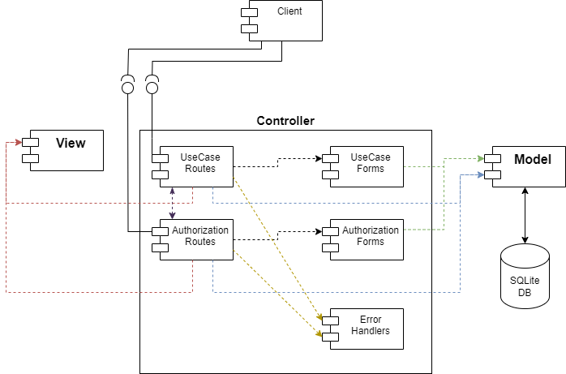
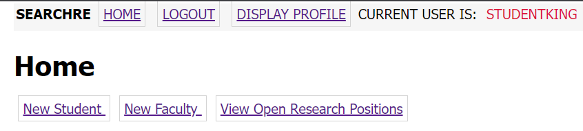
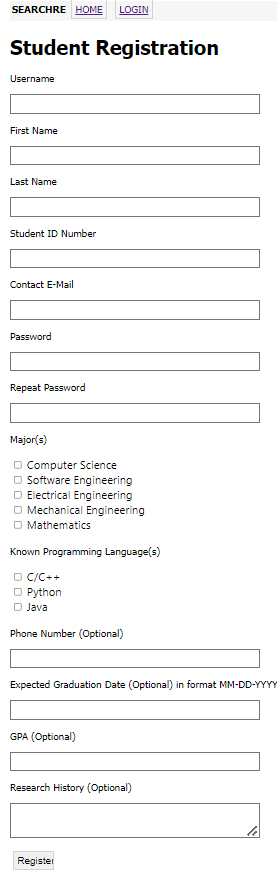
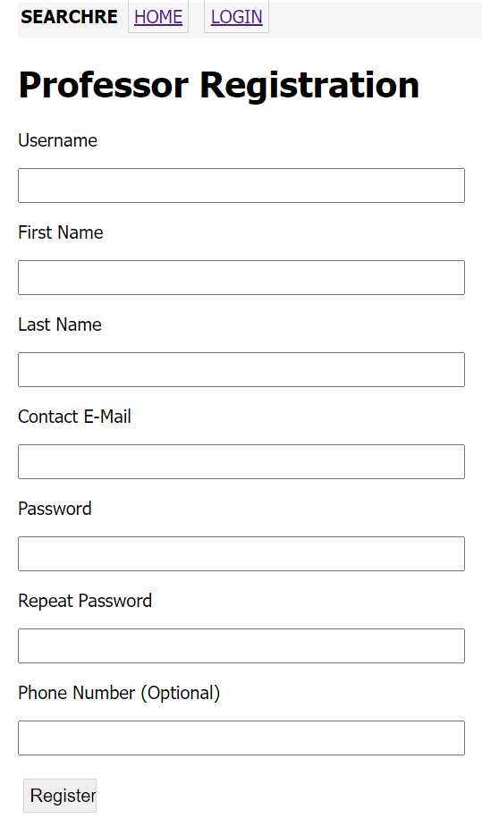
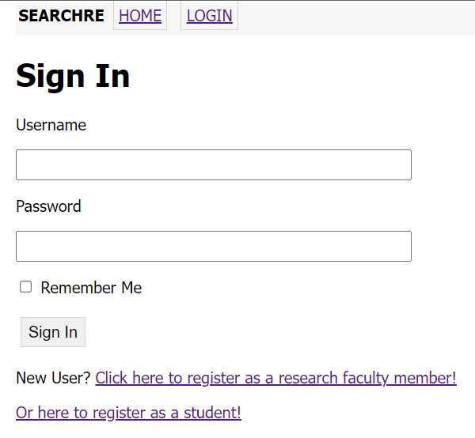
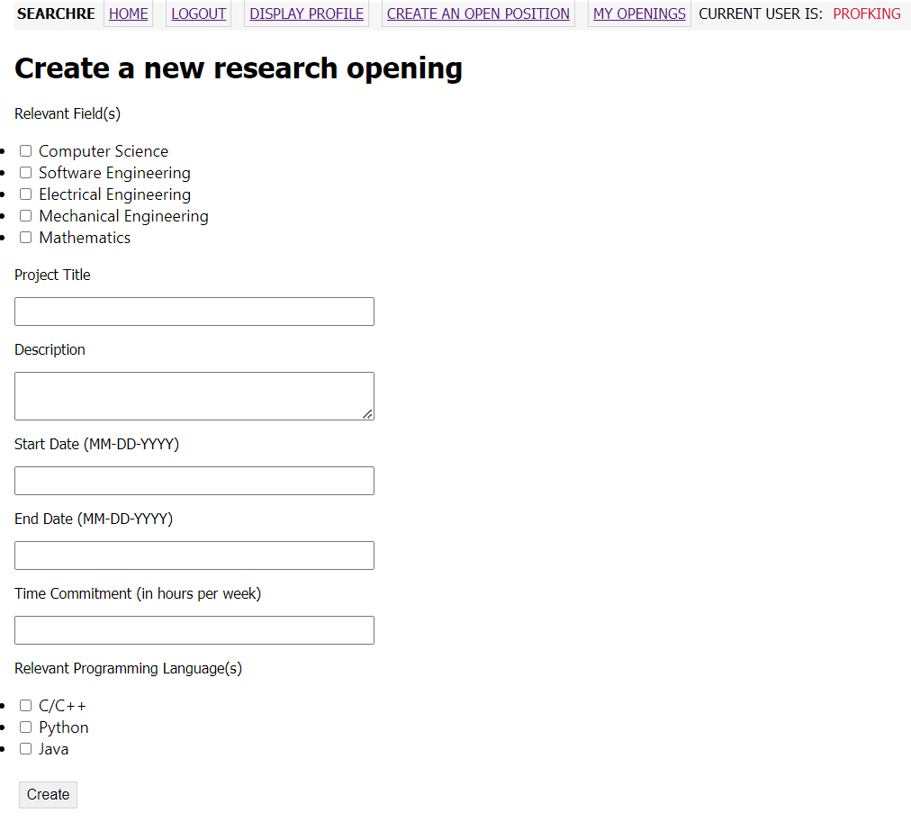
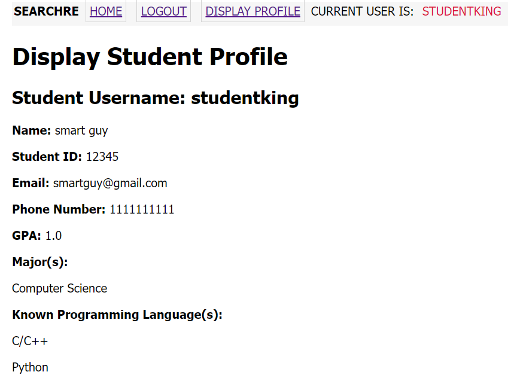
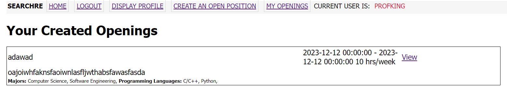

# Design Document

## SEARCHRe
--------
Prepared by:

* `Erik Holtrop`,`WSU`
* `Arlen Hills`,`WSU`
---

**Course** : CptS 322 - Software Engineering Principles I

**Instructor**: Sakire Arslan Ay

---

## Table of Contents
- [Design Document](#design-document)
  - [Your Project Title](#your-project-title)
  - [Table of Contents](#table-of-contents)
    - [Document Revision History](#document-revision-history)
- [1. Introduction](#1-introduction)
- [2.	Architectural and Component-level Design](#2architectural-and-component-level-design)
  - [2.1 System Structure](#21-system-structure)
  - [2.2 Subsystem Design](#22-subsystem-design)
    - [2.2.1 Model](#221-model)
    - [2.2.2 Controller](#222-controller)
    - [2.2.3 View and User Interface Design](#223-view-and-user-interface-design)
- [3. Progress Report](#3-progress-report)
- [4. Testing Plan](#4-testing-plan)
- [5. References](#5-references)

### Document Revision History

| Name | Date | Changes | Version |
| ------ | ------ | --------- | --------- |
| Template | 10-21-2023 | Copied template | 0.0        |
| First Half of First Draft | 10-22-2023 | Completed first drafts of 2.2.1 and 2.2.2 | 0.1 |
| Second Half of First Draft part 1 | 10-23-2023 | Completed 2.2.3 first draft, iteration1 portion of 3, 2.1  | 0.2 |
|      |      |         |         |

# 1. Introduction

Explain the purpose for providing this design document. If this is a revision of an earlier document, please make sure to summarize what changes have been made during the revision (keep this discussion brief). 

Then provide a brief description of your project and state your project goal.

At the end of the introduction, provide an overview of the document outline.

[Section II](#2-architectural-and-component-level-design) includes UML diagram, architecture description.

[Section III](#22-subsystem-design) includes Model, Controller, and View breakdown and description.

# 2.	Architectural and Component-level Design
## 2.1 System Structure

 
 - UseCase Routes handles use case actions the user does on the Client. For example creating an opening is handled in the UseCase routes subsystem.
 - Authorization Routes handles user registration and user login/logout. For example student or professor registration.
 - Error Handler handles when errors happen.
 - UseCase Forms contains forms needed for certain input use-cases.
 - Authorization Forms contains forms needed for student or professor registration and user login.

 Our rationale for this design is to allow for re-use of subsystems of other projects such as Authorization Routes. In this design the changes for user authorization and general use cases can be developed in parallel.

## 2.2 Subsystem Design 

(**Note1**: This is just a suggested template. If you adopted a pattern other than MVC, you should revise this template and the list the major subsystems in your architectural design.)

(**Note2**: You should describe the design for the end product (completed application) - not only your iteration1 version. You will revise this document in iteration-2 and make changes  and/or add more details in iteration-2.)

### 2.2.1 Model

The role of the model is to contain data's design and the methods for which the data can be accessed/modified. The model is also resonsible for business logic. The model encapsulates the state of the application.

User attributes:

| Name | Type | Description | Extra details |
| ------ | ------ | ------ | ------ | 
| id | Integer | Identification Number | primary key |
| username | String | User's tag or handle or username | unique, 60 chars max |
| first_name | String | User's first name | 60 chars max |
| last_name | String | User's last name | 60 chars max |
| user_type | String | What kind of user this is (like student or professor) | 50 chars max |
| password_hash | String | A hash used to securely verify and change passwords | 128 chars | 
| email | String | User's contact email | unique, 120 chars max 
| phone_number | Integer | User's contact phone number | unique, optional

Professor attributes:
Inherits from User, meaning it gains all of User's attributes.

| Name | Type | Description | Extra details |
| ------ | ------ | ------ | ------ | 
| id | Integer | Identification Number | primary key, overlaps with User's id to establish inheritance |
| openings | Relationship | The openings this Professor has created | Direct relationship with Opening class instances  |

Student attributes:

| Name | Type | Description | Extra details |
| ------ | ------ | ------ | ------ | 
| id | Integer | Identification Number | primary key, overlaps with User's id to establish inheritance |
| student_id | Integer | University issued identification number | unique |
| graduation_date | DateTime | Expected graduation date | - |
| gpa | Float | Student's GPA | optional
| research_history| String | A textual description of this student's history of participation in research | 500 chars max |
| majors | Relationship | The major(s) this student is participating in | Relationship with Major class instances through 'majoring_in' association table |
| programming_languages | Relationship | The programming language(s) this student has experience in | Relationship with ProgLang class instances through 'knows_language' association table |

Major attributes:

| Name | Type | Description | Extra details |
| ------ | ------ | ------ | ------ | 
| id | Integer | Identification Number | primary key |
| name | String | Major's name | 50 chars max |
| students | Relationship | The students that are majoring in this major | Relationship with Student class instances through 'majoring_in' association table |
| openings | Relationship | The openings that expect applicants to be majoring in this major | Relationship with Opening class instances through 'expects_major' association table |

ProgLang attributes:
| Name | Type | Description | Extra details |
| ------ | ------ | ------ | ------ | 
| id | Integer | Identification Number | primary key |
| name | String | Language's name | 20 chars max |
| students | Relationship | The students that know this programming language | Relationship with Student class instances through 'knows_language' association table |
| openings | Relationship | The openings that expect applicants to be know this programming language | Relationship with Opening class instances through 'expects_language' association table |

Opening attributes:
| Name | Type | Description | Extra details |
| ------ | ------ | ------ | ------ | 
| id | Integer | Identification Number | primary key |
| title | String | Opening's title | 100 chars max |
| description | String | Opening's description | 800 chars max |
| start | DateTime | Expected start date of work on the opening | - |
| end | DateTime | Expected end date of work on the opening | - |
| time_commitment | Integer | Expected number of hours that an applicant would work each week, should they be accepted | - |
| creator_id | Integer | The id of the Professor that created this opening | Overlaps with Professor's id to create relationship
| majors | Relationship | The majors that applicants are expected to have | Relationship with Major class instances through 'expects_major' association table |
| programming_languages | Relationship | The programming languages that applicants are expected to know | Relationship with ProgLang class instances through 'expects_language' association table |

(***in iteration -2***) Revise the database model. Provide a UML diagram of your database model showing the associations and relationships among tables. Your UML diagram should also show the methods of your models.

### 2.2.2 Controller 

The controller's role is to mediate between the view and the model. It is reponsible for getting the data from the model that the view needs to display, and using input from the view to update/access data in the model. For this product the controller also contains the routes, auth routes, forms, and error handlers.

(***in iteration-2***) Revise your route specifications, add the missing routes to your list, and update the routes you modified. Make sure to provide sufficient detail for each route. In iteration-2, you will be deducted points if you don’t include all major routes needed for implementing the required use-cases or if you haven’t described them in detail.

| Name  | Methods           | URL Path   | Description  |
|:--|:------------------|:-----------|:-------------|
| 1. Register Professor/Faculty | GET, POST | /registerprof | Shows registration form (registerProf.html) if GET method, or adds professor to database based on registration form inputs if valid if POST method.|
| 2. Register Student | GET, POST | /registerstudent | Shows registration form (registrationStudent.html) if GET method, or adds student to model based on registration form inputs if valid if POST method.|
| 3. Login |GET, POST| /login | Shows login form (login.html) if GET method, or logins into account based on login form inputs if there is one if POST method.|
| 4. Create Opening  | GET, POST | /create_opening | Shows opening creation form (createOpening.html #43 ) for GET method, or adds opening to database based on OpeningForm inputs if valid for POST method. Requires user to be logged in on a research faculty account.|
| 5. View Profile | GET | /profile | Shows profile page (profile.html). Requires user to be logged in.|
| 6. My Openings | GET | /myopenings | Shows My Openings page (myopenings.html). Requires faculty user to be logged in.|
| 7. Index | GET | / | Shows home page, which would be different between students and professors. |
| 8. View Openings | GET, POST | /openings | Shows all current open positions ("openings"), with options to sort and filter them. Requires student user to be logged in |
| 9. Edit Profile | GET, POST | /profile/edit | Shows profile editing form for GET method, or updates current user's profile according to editing form's inputs if valid for POST method. Requires user to be logged in. |

### 2.2.3 View and User Interface Design 

The role of the view is to use templates and forms from the controller to create friendly user interfaces. It is responsible for the look and representation of the product. We plan to use Bootstrap CSS framework in the future to enhance the view.

(***in iteration-2***) Revise your page list and descriptions and include any additional pages that you will include in your view.  In iteration-2, you will be deducted points if your view description is still superficial and doesn't list and explain all pages of your application. 

| Template | Description | Use-Case(s) |
| -------- | ----------- | ----------- |
| base.html | Most pages the user interacts with extends base.html. Includes the navigation bar and flash message handler. As of iteration 1, navigation bar has buttons for Home, Login, Logout, Display Profile, Create an Opening, My Openings. Buttons have checks to see whether they should be displayed to the current user. | All |
| index.html | A basic home page available to both types of users and doesn't require logged in. As of iteration 1, has buttons for student and professor registration and the all openings page. | Home Page |
| 404error.html | Page for when action results in 404 error. | N/A |
| 500error.html | Page for when action results in 500 error. | N/A |
| registerStudent.html | Renders StudentRegistration form. Registration page to add a Student User and their entered information to database. | Student Account Creation |
| registerProf.html | Renders ProfRegistration form. Registration page to add a Professor User and their entered information to database. | Professor Account Creation |
| login.html | Renders LoginForm form. A login page for users to enter valid username and password, optionally select Remember Me, or go to a registration page. Users are redirected to this page when trying to access pages which require the user to be logged in. | Student Account Creation (redirect), Professor Account Creation (redirect), Log in |
| createOpening.html | Renders OpeningForm form. A page for faculty members/professor users to input information about a research position opening and add it to the database. | Research Opening Creation |
| professor_profile.html | Displays information about user if their user_type is 'Professor'. | View Profile |
| student_profile.html | Displays information about user if their user_type is 'Student'. | View Profile |
| _miniopening.html | For displaying a mini view of a reseach position opening's information for the sake of displaying in a list. Later, implentation for entering an openings full details page will be added. | View All Current Openings (As Student), View Current Created Openings, View Position's Full-Details | 
| allOpenings.html | As of iteration 1, just displays a list of all openings. | View All Current Openings (As Student) |
| myOpenings.html | Just displays a list of all openings that were created by current_user, accessible to faculty members/professor users only since they solely have the power to create openings. | View Current Created Openings |

-  
- 
- 
- 
- 
- 
- 
- 
- 

# 3. Progress Report

For our team, iteration 1 came with some challenges. Unexpectedly, team member Arlen Hills contracted a rough illness during the week of iteration 1 which led to some complications in work output. Said team member didn't do the best job of communicating to his partner about his issues, or reach out for help, which had he done so would've mitigated the issues. Thus, there was a large period where vital bugs had gone unnoticed and minimal work was done. However, after communication between partners there was a clear layout of tasks and times which resulted in a smooth finish and a satisfactory product to end iteration 1. Iteration 1 ended up included major use cases such as registration, login, profile view, and opening creation and listing.

# 4. Testing Plan

(***in iteration 2***)
In this section , provide a brief description of how you plan to test the system. Thought should be given to  mostly how automatic testing can be carried out, so as to maximize the limited number of human hours you will have for testing your system. Consider the following kinds of testing:
  * *Unit Testing*: Explain for what modules you plan to write unit tests, and what framework you plan to use.  (Each team should write automated tests (at least) for testing the routes)
  * *Functional Testing*: How will you test your system to verify that the use cases are implemented correctly? 
  * *UI Testing*: How do you plan to test the user interface?  (Manual tests are OK)

# 5. References

None.

----