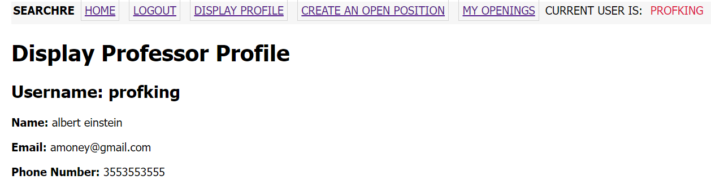
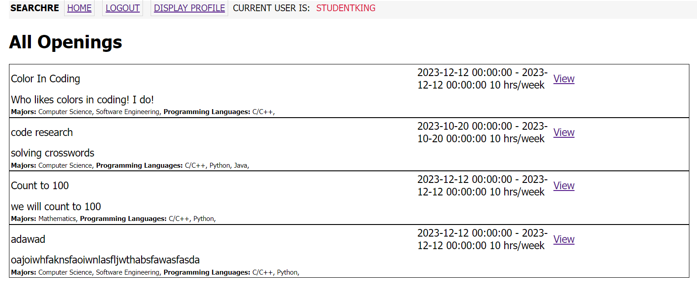

# Design Document

## SEARCHRe
--------
Prepared by:

* `Erik Holtrop`,`WSU`
* `Arlen Hills`,`WSU`
---

---

## Table of Contents
- [Design Document](#design-document)
  - [Table of Contents](#table-of-contents)
    - [Document Revision History](#document-revision-history)
- [1. Introduction](#1-introduction)
- [2.	Architectural and Component-level Design](#2architectural-and-component-level-design)
  - [2.1 System Structure](#21-system-structure)
  - [2.2 Subsystem Design](#22-subsystem-design)
    - [2.2.1 Model](#221-model)
    - [2.2.2 Controller](#222-controller)
    - [2.2.3 View and User Interface Design](#223-view-and-user-interface-design)
- [3. Progress Report](#3-progress-report)
- [4. Testing Plan](#4-testing-plan)
- [5. References](#5-references)

### Document Revision History

| Name | Date | Changes | Version |
| ------ | ------ | --------- | --------- |
| Template | 10-21-2023 | Copied template | 0.0        |
| First Half of First Draft | 10-22-2023 | Completed first drafts of 2.2.1 and 2.2.2 | 0.1 |
| Second Half of First Draft part 1 | 10-23-2023 | Completed 2.2.3 first draft, iteration1 portion of 3, 2.1  | 0.2 |
| Second Half of First Draft part 2 | 10-23-2023 | Completed Introduction and added subsystem descriptions to 2.2.2 | 0.3 |
| First Half of Iteration 2 step | 11-7-2023 | Updates to all sections to bring it up to iteration-2 requirements. | 0.4 |
| Second Half of Iteration 2 step | 11-7-2023 | UML-diagram of model, progress report, controller routes. | 0.5 |

# 1. Introduction

The purpose of this document is to provide a semi-technical explaination of the product. This document provides an overview of the product's design without going into implementation details.

This product will serve as a medium for university research faculty looking to fill research position. This will be done by allowing faculty to advertise positions through the product using a faculty account. Faculty will then be able to review candidates who have applied for their posted positions. Students will be able to make accounts with their information, search for research opportunities and apply to them. This product alleviates the issue of faculty who cannot always reach all students with related research interests by allowing them to view as many possible candidates as possible.

[Section II](#2-architectural-and-component-level-design) includes UML diagram, architecture description.

[Section III](#22-subsystem-design) includes Model, Controller, and View breakdown and description.

# 2.	Architectural and Component-level Design
## 2.1 System Structure

 
 - UseCase Routes handles use case actions the user does on the Client. For example creating an opening is handled in the UseCase routes subsystem.
 - Authorization Routes handles user registration and user login/logout. For example student or professor registration.
 - Error Handler handles when errors happen.
 - UseCase Forms contains forms needed for certain input use-cases.
 - Authorization Forms contains forms needed for student or professor registration and user login.

 Our rationale for this design is to allow for re-use of subsystems of other projects such as Authorization Routes. In this design the changes for user authorization and general use cases can be developed in parallel.

## 2.2 Subsystem Design 

### 2.2.1 Model

The role of the model is to contain data's design and the methods for which the data can be accessed/modified. The model is also resonsible for business logic. The model encapsulates the state of the application.

User attributes:

| Name | Type | Description | Extra details |
| ------ | ------ | ------ | ------ | 
| id | Integer | Identification Number | primary key |
| username | String | User's tag or handle or username | unique, 60 chars max |
| first_name | String | User's first name | 60 chars max |
| last_name | String | User's last name | 60 chars max |
| user_type | String | What kind of user this is (like student or professor) | 50 chars max |
| password_hash | String | A hash used to securely verify and change passwords | 128 chars | 
| email | String | User's contact email | unique, 120 chars max 
| phone_number | Integer | User's contact phone number | unique, optional

Professor attributes:
Inherits from User, meaning it gains all of User's attributes.

| Name | Type | Description | Extra details |
| ------ | ------ | ------ | ------ | 
| id | Integer | Identification Number | primary key, overlaps with User's id to establish inheritance |
| openings | Relationship | The openings this Professor has created | Direct relationship with Opening class instances  |

Student attributes:

| Name | Type | Description | Extra details |
| ------ | ------ | ------ | ------ | 
| id | Integer | Identification Number | primary key, overlaps with User's id to establish inheritance |
| student_id | Integer | University issued identification number | unique |
| graduation_date | DateTime | Expected graduation date | - |
| gpa | Float | Student's GPA | optional
| research_history| String | A textual description of this student's history of participation in research | 500 chars max |
| majors | Relationship | The major(s) this student is participating in | Relationship with Major class instances through 'majoring_in' association table |
| programming_languages | Relationship | The programming language(s) this student has experience in | Relationship with ProgLang class instances through 'knows_language' association table |

Major attributes:

| Name | Type | Description | Extra details |
| ------ | ------ | ------ | ------ | 
| id | Integer | Identification Number | primary key |
| name | String | Major's name | 50 chars max |
| students | Relationship | The students that are majoring in this major | Relationship with Student class instances through 'majoring_in' association table |
| openings | Relationship | The openings that expect applicants to be majoring in this major | Relationship with Opening class instances through 'expects_major' association table |

ProgLang attributes:
| Name | Type | Description | Extra details |
| ------ | ------ | ------ | ------ | 
| id | Integer | Identification Number | primary key |
| name | String | Language's name | 20 chars max |
| students | Relationship | The students that know this programming language | Relationship with Student class instances through 'knows_language' association table |
| openings | Relationship | The openings that expect applicants to be know this programming language | Relationship with Opening class instances through 'expects_language' association table |

Opening attributes:
| Name | Type | Description | Extra details |
| ------ | ------ | ------ | ------ | 
| id | Integer | Identification Number | primary key |
| title | String | Opening's title | 100 chars max |
| description | String | Opening's description | 800 chars max |
| start | DateTime | Expected start date of work on the opening | - |
| end | DateTime | Expected end date of work on the opening | - |
| time_commitment | Integer | Expected number of hours that an applicant would work each week, should they be accepted | - |
| creator_id | Integer | The id of the Professor that created this opening | Overlaps with Professor's id to create relationship
| majors | Relationship | The majors that applicants are expected to have | Relationship with Major class instances through 'expects_major' association table |
| programming_languages | Relationship | The programming languages that applicants are expected to know | Relationship with ProgLang class instances through 'expects_language' association table |

Application attributes:
| Name | Type | Description | Extra details |
| ------ | ------ | ------ | ------ | 
| id | Integer | Identification Number | primary key |
| interest_statement | String | Student's interest statement, reason for applying. | 500 chars max |
| reference_name | String | Name of student reference. | 100 chars max |
| reference_email | String | Email for reference provided. | 100 chars max, email format |
| applicant_id | Integer | The id of the Student that submitted the application | Overlaps with Student's id to create relationship |
| opening_id | The id of the opening the application was submitted for | Overlaps with Opening's id to create relationship |

### 2.2.2 Controller 

The controller's role is to mediate between the view and the model. It is reponsible for getting the data from the model that the view needs to display, and using input from the view to update/access data in the model. For this product the controller also contains the routes, auth routes, forms, and error handlers.

UseCase Routes subsystem is responsible for use-case actions. Some use-case actions require that the user has gone through Authorization Routes to be successfully logged in. It is dependent on UseCase forms as well if the action requires user input. Dependent on error handler for 404/500 errors.

Authorization Routes substem is responsible for user registration and login/logout. This subsystem enures uniqueness among specific user attributes. It is dependent upon Authorization Forms for user input. Dependent on error handler for 404/500 errors.

Error Handler handles error messages. In case of 404/500 error error handler will load respective templates.

UseCase Forms subsystem is responsible for use case forms to get user input.

Authorization Forms subsystem is responsible for student registration faculty registration and user login forms.

| Name  | Methods           | URL Path   | Description  |
|:--|:------------------|:-----------|:-------------|
| 1. Register Professor/Faculty | GET, POST | /registerprof | Shows registration form (registerProf.html) if GET method, or adds professor to database based on registration form inputs if valid if POST method.|
| 2. Register Student | GET, POST | /registerstudent | Shows registration form (registrationStudent.html) if GET method, or adds student to model based on registration form inputs if valid if POST method.|
| 3. Login |GET, POST| /login | Shows login form (login.html) if GET method, or logins into account based on login form inputs if there is one if POST method.|
| 4. Logout | GET | /logout | Calls logout_user() and redirects user to login page. Requires logged in. |
| 5. Create Opening  | GET, POST | /createopening | Shows opening creation form (createOpening.html #43 ) for GET method, or adds opening to database based on OpeningForm inputs if valid for POST method. Requires user to be logged in on a research faculty account.|
| 6. View Profile | GET | /profile | Shows profile page (profile.html). Requires user to be logged in.|
| 7. My Openings | GET | /myopenings | Shows My Openings page (myopenings.html). Requires faculty user to be logged in.|
| 8. Index | GET | / | Takes anonymous users to default home page, and redirects students to student homepage and faculty to the faculty homepage. |
| 9. View Openings | GET, POST | /openings | Shows all current open positions ("openings"), with options to sort and filter them. Requires student user to be logged in |
| 10. Edit Profile | GET, POST | /profile/update | Shows profile editing form for GET method, or updates current user's profile according to editing form's inputs if valid for POST method. Requires user to be logged in. |
| 11. Student Home | GET | /studenthome | Shows home page for students (student_home.html). For student users only.|
| 12. Faculty Home | GET | /profhome | Shows home page for faculty users (prof_home.html). For faculty users only. |
| 13. Opening Details | GET, POST | /opening/\<oid>/ | GET shows full details of desired opening (full_details.html), and the applications for it (for faculty). Faculty may close their opening (POST). Requires user logged in. |
| 14. Apply | GET, POST | /opening/application/\<oid>/ | GET loads application form (application.html). On POST application form is validated and added to database. Student users only. |
| 15. Opening Application | GET, POST | /opening/application/\<oid>/\<aid> | GET shows full details of an applicant and their application to an opening (full_application.html). Faculty may change the status of the pending application (POST). Faculty users only. |
| 17. Submitted Applications | GET | /myapplications | Displays a list of current user's submitted applications (my_applications.html). Student users only.

### 2.2.3 View and User Interface Design 

The role of the view is to use templates and forms from the controller to create friendly user interfaces. It is responsible for the look and representation of the product. We plan to use Bootstrap CSS framework in the future to enhance the view.

| Template | Description | Use-Case(s) |
| -------- | ----------- | ----------- |
| base.html | Most pages the user interacts with extends base.html. Includes the navigation bar and flash message handler. As of iteration 1, navigation bar has buttons for Home, Login, Logout, Display Profile, Create an Opening, My Openings. Buttons have checks to see whether they should be displayed to the current user. | All |
| index.html | Basic landing page for anonymous users, offers a description of the website and two buttons for registration. | Home Page |
| student_home.html | Basic landing page for student users. Provides buttons to student based actions (viewing all openings, viewing submitted applications). Features may include loading important information such as changes in application status. | Home Page |
| prof_home.html | Basic landing page for faculty users. Provides buttons to faculty based actions (creating an opening, viewing created openings).
| 404error.html | Page for when action results in 404 error. | N/A |
| 500error.html | Page for when action results in 500 error. | N/A |
| registerStudent.html | Renders StudentRegistration form. Registration page to add a Student User and their entered information to database. | Student Account Creation |
| registerProf.html | Renders ProfRegistration form. Registration page to add a Professor User and their entered information to database. | Professor Account Creation |
| login.html | Renders LoginForm form. A login page for users to enter valid username and password, optionally select Remember Me, or go to a registration page. Users are redirected to this page when trying to access pages which require the user to be logged in. | Student Account Creation (redirect), Professor Account Creation (redirect), Log in |
| createOpening.html | Renders OpeningForm form. A page for faculty members/professor users to input information about a research position opening and add it to the database. | Research Opening Creation |
| professor_profile.html | Displays information about user if their user_type is 'Professor'. | View Profile |
| student_profile.html | Displays information about user if their user_type is 'Student'. | View Profile |
| _miniopening.html | For displaying a mini view of a reseach position opening's information for the sake of displaying in a list. Contains button to redirect to full details page about the opening. Features will include displaying application status for students, and applicant count for faculty. | View All Current Openings (As Student), View Current Created Openings, View Position's Full-Details | 
| allOpenings.html | Displays a list of all openings with a button to view full details. Features will include displaying application status for students, and applicant count for faculty. | View All Current Openings (As Student) |
| myOpenings.html | Just displays a list of all openings that were created by current_user, accessible to faculty members/professor users only since they solely have the power to create openings. | View Current Created Openings |
| application.html | Renders ApplicationForm form. A page for students to submit an application to an opening. | Create Application |
| my_applications.html | Displays a list of applications the user has submitted. Each application has a button to redirect to the opening it was for. | View Applications (as Student) |
| full_details.html | For displaying all details in full about a research position opening. Contains a button to apply for student users, or a list of applicants for faculty users. Faculty users can redirect into each submitted application to view full details of the application and applicant. | View Position's Full-Details |
| full_application.html | Displays all information about an applicant and what was submitted in ApplicationForm. Features for faculty users will include being able to take actions such as Accept or Reject. | View Applicants |
| _miniapplicant.html | For displaying applicants in a list on full details page for faculty users to see concisely. | View Applicants |
| _mini_application.html | For displaying list of applications for student users to see consicsely. Features will include showing application status. | View Applications (As Student) |
| update_profile.html | Renders appropriate forms for user type to allow edits to editable user information. | Update Profile |

-  
- 
- 
- 
- 
- 
- 
- 
- 

# 3. Progress Report

For our team, iteration 1 came with some challenges. Unexpectedly, team member Arlen Hills contracted a rough illness during the week of iteration 1 which led to some complications in work output. Said team member didn't do the best job of communicating to his partner about his issues, or reach out for help, which had he done so would've mitigated the issues. Thus, there was a large period where vital bugs had gone unnoticed and minimal work was done. However, after communication between partners there was a clear layout of tasks and times which resulted in a smooth finish and a satisfactory product to end iteration 1. Iteration 1 ended up included major use cases such as registration, login, profile view, and opening creation and listing.

Iteration 2 progress has been exceptional. After getting the ball rolling with iteration 1 we can feel the beneficial effects of all the setup we've done and planning established. Not only that but the beauty of the Scrum developement process. We simply met, discussed, established tasks, delegated, and were free to work at our pace. After the illness set-back of iteration 1, team member Arlen Hills took on a larger work load to balance things out. Communication was utilized heavily this iteration to ensure tasks were completed in an efficient and logical order which required re-assignment of tasks a couple times. Iteration 2's product is satisfactory to what we had set out to do, and the framework for our final iteration is clear. Iteration 2 updates included student application, full detail view, all openings view, profile editing, application listing for both student and faculty, and application viewing for faculty, and lastly seperate homepages for user types.

# 4. Testing Plan

## 4.1 Unit Testing

We will use unittest to test our models and forms. This includes testing for the following:

- Setting and checking user passwords
- Form validation
  - Each form needs at the very least a successful validation test case and a failed validation test case
  - Registration forms should also have an extra set of test cases, where the isUpdateForm is set to true and validated as if it were a profile update form

## 4.2 Functional Testing

We will again be using unittest for functional testing. Functional testing will focus on our routes and include testing for the following:

- GET/POST requesting each route
  - Each route needs at least one test per method. These tests should use realistic input and assert that an acceptable message is flashed and that the user is redirected to the correct page

## 4.3 UI Testing

UI Testing will be done manually. We will focus on our html page templates for UI testing. These tests should be completed as the pages are completed and updated, as well as during iteration 3. UI Testing should include the following:

- The eye-check for each page
  - This is admittedly very vibes-based. The tester will simply load up a page and look for any glaring problems.
- Checking every button
  - Each button should redirect to the correct page. The possibility for automatic redirects (such as if the user is the wrong user-type or not logged in) should be kept in mind.

# 5. References

None.

----