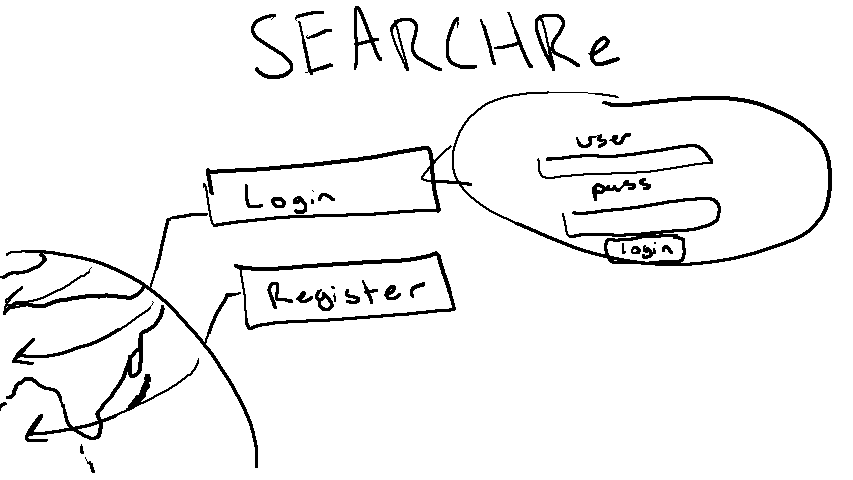
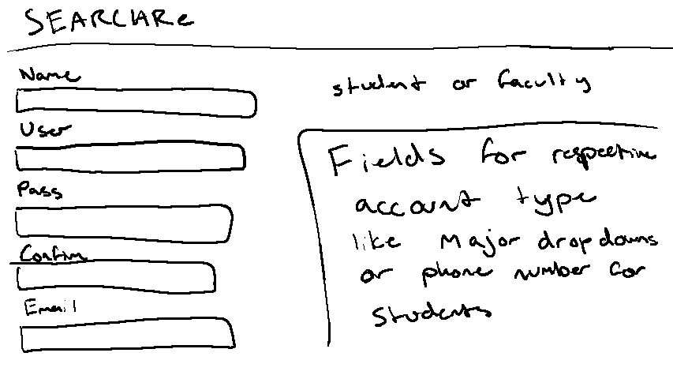
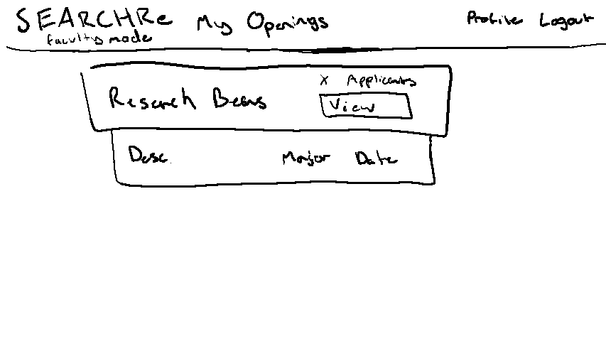
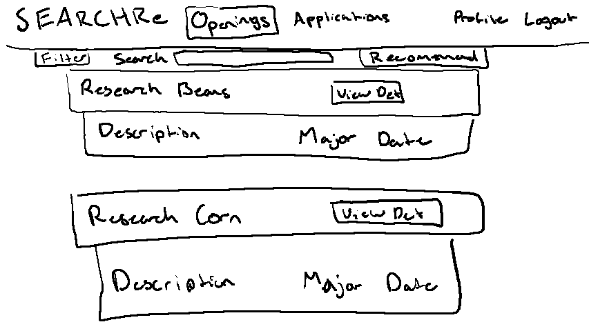
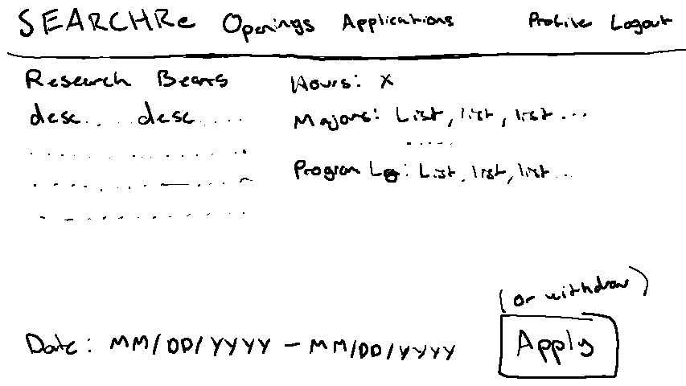
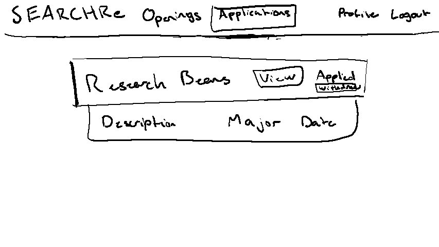

# Software Requirements Specification

## SEARCHRe
--------
Prepared by:

* `Erik Holtrop `,`Washington State University`
* `Arlen Hills `,`Washington State University`

---

**Course** : CptS 322 - Software Engineering Principles I

**Instructor**: Sakire Arslan Ay

---

## Table of Contents
- [Software Requirements Specification](#software-requirements-specification)
  - [Your Project Title](#your-project-title)
  - [Table of Contents](#table-of-contents)
  - [Document Revision History](#document-revision-history)
- [1. Introduction](#1-introduction)
  - [1.1 Document Purpose](#11-document-purpose)
  - [1.2 Product Scope](#12-product-scope)
  - [1.3 Document Overview](#13-document-overview)
- [2. Requirements Specification](#2-requirements-specification)
  - [2.1 Customer, Users, and Stakeholders](#21-customer-users-and-stakeholders)
  - [2.2 Use Cases](#22-use-cases)
  - [2.3 Non-Functional Requirements](#23-non-functional-requirements)
- [3. User Interface](#3-user-interface)
- [4. Product Backlog](#4-product-backlog)
- [4. References](#4-references)

## Document Revision History

| Name | Date | Changes | Version | Editor
| ------ | ------ | --------- | --------- | --------- |
| Template |2023-10-05 |Initial draft | 0.0        | Sakire Arslan Ay
| Authorship Addition      | 2023-10-07      | Added Authorship | 0.1 | Erik Holtrop
| First Draft     | 2023-10-07|Filled out most of body|1.0| Arlen Hills
| First Draft Grammatical Review | 2023-10-07| Fixed a few typos | 1.1 | Erik Holtrop 
| First Draft Use Cases edition| 2023-10-09 | Added first batch of use cases from github repo into SRS template | 1.1 | Arlen Hills
| First Draft Use Cases edition cont. | 2023-10-11 | Imported all use cases into SRS | 1.2 | Arlen Hills
| First Daft Use Cases edition cont. | 2023-10-11 | Fixed formatting errors for list of use cases | 1.2.1 | Arlen Hills
| First Week submission draft. | 2023-10-11 |  Fixed use case misnumbering, added image links, non-functional requirements, removed rubric. | 1.3 | Arlen Hills
| First Week Submission draft (reviewed) | 2023-10-11 | Removed some broken links and fixed revision history table | 1.3.1 | Erik Holtrop

----
# 1. Introduction

This section provides an overview of the entire document.

## 1.1 Document Purpose

This Software Requirement Specification document provides a guide for developers to go from the product outline all the way to the products backlog. This document also describes the product's requirements for customers to understand clearly what the service is capable of. It should serve useful for developers and customers in understanding the goals of the product. The document should also be helpful for developers which may join the project in the middle of developement. 

## 1.2 Product Scope

This product will serve as a medium for university research faculty looking to fill research position. This will be done by allowing faculty to advertise positions through the product using a faculty account. Faculty will then be able to review candidates who have applied for their posted positions. Students will be able to make accounts with their information, search for research opportunities and apply to them. This product alleviates the issue of faculty who cannot always reach all students with related research interests by allowing them to view as many possible candidates as possible.

## 1.3 Document Overview

This document first lists requirement specifications. Then specifications are broken down into the use cases and their descriptions followed by the list of non-functional requirements. After which a sketch of the software's user interface is found as well as a link to the product backlog. Lastly, a list of references is provided.

----
# 2. Requirements Specification

This section specifies the software product's requirements. Specify all of the software requirements to a level of detail sufficient to enable designers to design a software system to satisfy those requirements, and to enable testers to test that the software system satisfies those requirements.

## 2.1 Customer, Users, and Stakeholders

The intended customers are universities that would like to hire more students in research positiions. The users are the faculty who conduct research and would like to advertise their research opportunity positions to a wider range of students beyond their classes. Users also include university undergraduates and graduate students looking for research opportunities available to them. The stakeholders are the universities which purchase the service, and the faculty and students who participate in using it.

----
## 2.2 Use Cases

This section includes the list of use cases for the software. There are cases for both types of users, Students, and Research Faculty/Faculty/Professors. Student accounts are for applying to research position openings. Research Faculty/Faculty/Professor accounts are responsible for the posting of research position openings. The other use cases are elaborated below.

| Use case # 1      |   |
| ------------------ |--|
| Name              | Student Account Creation |
| Users             | Student |
| Rationale         |  When a student wants to use the system, they should create an account which gets added to the system.  |
| Triggers          |  A student intends to create an account  OR a user tries to access a webpage that requires a (student) account and chooses to create a new account to do so  |
| Preconditions     |  The student does not have an account.  |
| Actions           |  1. The student indicates that they want to create an account  2. The system navigates to a registration page or pop-up.  3.  The student is prompted to enter their information, including: - First Name - Last Name - Username - Student ID - Contact E-Mail - Password - Major(s) **Optional Fields:** - Contact Number - Expected Graduation Term - Cumulative GPA  - Research History 4. The system validates their information according to appropriate length limitations, password strength, password being typed twice, and uniqueness of student ID and username.  5. Redirect to the log in page. |
| Alternative paths |  None |
| Postconditions    |  The student's account is added to the system and the student is on the log in page.|
| Acceptance tests  | (i) Check whether the user can log in with their provided info (ii) Check whether the profile page matches the student's provided info (iii) Check whether the student shows up when searched for by faculty |
| Iteration         |  iteration 1  |

| Use case # 2      |   |
| ------------------ |--|
| Name              |  Professor Account Creation |
| Users             |  Research Faculty |
| Rationale         |  When a professor* wants to use the system, they should create an account which gets added to the system.  |
| Triggers          |  A professor* intends to create an account  OR a professor* tries to access a webpage that requires a faculty account and chooses to register a new account to do so  |
| Preconditions     |  The professor* does not have an account.  |
| Actions           |  1. The professor* indicates that they want to create an account  2. The system navigates to a registration page or pop-up.  3.  The professor* is prompted to enter their information, including: - First Name - Last Name - Username - Contact E-Mail - Password **Optional Fields:** - Contact Number 4. The system validates their information according to appropriate length limitations, password strength, password being typed twice, and uniqueness of Username. 5. Redirect to the log in page. |
| Alternative paths |  None |
| Postconditions    |  The professor's* account is added to the system and the professor* is on the log in page.|
| Acceptance tests  | (i) Check whether the user can log in with their provided info (ii) Check whether the profile page matches the professor's* provided info|
| Iteration         |  iteration 1  |

*Professor is just short hand research faculty member

| Use case # 3      |   |
| ------------------ |--|
| Name              | Log In |
| Users             |  Research Faculty or Student |
| Rationale         |  When a user wants to access the system through a pre-existing account, they should log in to that account. |
| Triggers          |  A user intends to access the website through their pre-existing account;  OR a user tries to access a webpage that requires an account and chooses to log in to do so |
| Preconditions     |  The user has an account.  |
| Actions           |  1. The user indicates that they want to log in 2. The system navigates to a login page or pop-up.  3.  The professor* is prompted to enter their information, including: - Username or Student ID - Password 4. The system validates that there exists an account with that Username or Student ID, then verifies that the password inputted matches the password tied to that account 5. Redirect to home page. |
| Alternative paths |  If the user was redirected to log-in page/pop-up by a page that required an account  |
| Postconditions    |  The user is logged in.|
| Acceptance tests  | Check whether the user can access account-required pages like profile page|
| Iteration         |  iteration 1  |

| Use case # 4      |   |
| ------------------ |--|
| Name              |  Research Opening Creation |
| Users             |  Research Faculty |
| Rationale         |  When a professor* has an open research position they should create a profile for it which gets added to the system|
| Triggers          |  A professor* intends to advertise an open research position. |
| Preconditions     |  This research position is not already on the website. |
| Actions           |  1. The professor* indicates that they want to create an open research position profile.  2. The system navigates to a position creation page.  3.  The professor* is prompted to enter information about the position, including: - Project Title - Project Description - Start Date - End Date - Anticipated Time Commitment - Majors (chosen from a list) - Programing language (chosen from a list) 4. The system validates their information according to appropriate length limitations and end date being after start date.  5. Redirect to the My Openings page (I don't know what the page is called yet). |
| Alternative paths |  None |
| Postconditions    |  The position is added to the system and the user is on the My Openings page. |
| Acceptance tests  | (i) Check whether the position is on the My Openings page (ii) Check whether the position shows up when searched for by students |
| Iteration         |  iteration 1  |

*Professor is just short-hand for research faculty member.

| Use case # 5      |   |
| ------------------ |--|
| Name              |  View Profile |
| Users             |  Research Faculty or Student |
| Rationale         |  When a user wants to see their profile, it should be displayed to them. |
| Triggers          |  A user intends to see their profile. |
| Preconditions     |  The user has an account and is logged in to it. |
| Actions           |  1. The user indicates that they want to see their profile  2. The system navigates to a Profile page with information about their profile, including: - Account Type (student or faculty) - Username - First Name - Last Name  - Contact E-Mail - Contact Number **If they are a student:** - Programming Languages - Major - Cumulative GPA  - Expected Graduation Term - Link to current applications  - CV/Resume stuff **If they are a research faculty member**  - Link to submitted openings   3. The system validates their information according to appropriate length limitations and end date being after start date.  4. Redirect to the My Openings page (I don't know what the page is called yet). |
| Alternative paths |  None |
| Postconditions    |  The user is on their Profile page. |
| Acceptance tests  | (i) Check whether the user is on the Profile page (ii) Check whether the details of their profile are correct |
| Iteration         |  iteration 1  |

| Use case # 6      |   |
| ------------------ |--|
| Name              | Update Profile |
| Users             | Faculty Member or Student |
| Rationale         |  When a user has changes or additions to the details of their profile, those details should be updated in the system.  |
| Triggers          |  A user intends to update their profile's details.  |
| Preconditions     |  The user has an account and is on their Profile page   |
| Actions           |  1. The user indicates they want to update their profile.  2. The system navigates to a profile update page. 3.  The student is prompted to modify or expand their information, including: - First Name - Last Name - Username - Contact E-Mail - Password - Contact Number  **If the user is a student:** - Major(s) - Expected Graduation Term - Cumulative GPA  Research History 4. The system validates new information according to appropriate length limitations, password strength, password being typed twice, and uniqueness of username and student ID if applicable. 5. Redirect to the Profile page. |
| Alternative paths |  None |
| Postconditions    |  The student's account is updated in the system and the student is on the Profile page.|
| Acceptance tests  | (i) Check whether the user can log in with their new password (if applicable) (ii) Check whether the profile page matches the user's inputted info|
| Iteration         |  iteration 2  |

| Use case # 7      |   |
| ------------------ |--|
| Name              | View All Current Openings (As Student)  |
| Users             | Students  |
| Rationale         | When a student wants to look at open positions they should see all the available ones  |
| Triggers          | The student intends to view all position openings  |
| Preconditions     | Student is logged in and there is at least one posted open position. |
| Actions           | 1. Student indicates they want to view all position openings.  2.  The system navigates to the Openings page where positions that are open are displayed with summarized details.|
| Alternative paths | None  |
| Postconditions    | Student is on the Openings page  |
| Acceptance tests  | (i) Check whether student is on Openings page. (ii) Student can see at least one open position on the page.  |
| Iteration         | iteration 2  |

| Use case # 8      |   |
| ------------------ |--|
| Name              | Search Openings  |
| Users             | Students |
| Rationale         | When a student wants to look at a filtered portion of position openings instead of all of them.  |
| Triggers          | The student intends to view a position openings that match wanted keywords/qualities  |
| Preconditions     | Student is logged in and on the Openings page (name WIP) and there is at least one posted open position. |
| Actions           | 1. Student indicates they want to search for a specific group of position openings.  2.  The student enters keyword(s) into a search tool.  3. The system filters Openings page to only display positions containing entered keyword(s).|
| Alternative paths | None  |
| Postconditions    | Student only sees open positions containing desired keyword(s)  |
| Acceptance tests  | (i) Student sees position openings.  (ii) The openings that can be seen contain desired keyword(s).   |
| Iteration         | iteration 3  |

| Use case # 9      |   |
| ------------------ |--|
| Name              | View Recommended Openings  |
| Users             | Students  |
| Rationale         | When a student wants to see algorithmically recommended for them.  |
| Triggers          | The student wants recommended positions openings to be shown first.  |
| Preconditions     | Student is logged in and on the Openings page (name WIP), there is at least one posted open position, and student has filled out enough information in their profile to provide the algorithm with data to sort with. |
| Actions           | 1. Student indicates they want to sort position openings by recommendation.  2.  The system sorts all available position openings, placing recommended ones at first/at the top.|
| Alternative paths | None |
| Postconditions    | Student is on the Openings page with the postion openings sorted to show recommended ones first.  |
| Acceptance tests  | (i) Openings page is sorted.  (ii) The positions that appear first are most relatable to the student.  |
| Iteration         | iteration 3  |

| Use case # 10      |   |
| ------------------ |--|
| Name              | Create Application |
| Users             |  Student |
| Rationale         |  When a student wants to apply for an opening, they should create an application for it. |
| Triggers          |  A student intends to apply to an opening. |
| Preconditions     |  The student is logged in and is on the full details page for an opening   |
| Actions           |  1. The user indicates that they want to apply to an application that they are on the full-details page for.  2. The system navigates to an application page for the opening, which continues to show full details about the opening.  3.  The student is prompted to enter their application information, including: -  A brief statement explaining why they are interested in this research topic and what they hope to gain by participating in that project - Name of a reference faculty member - Contact email of that same reference faculty member. 4. The system stores the application data including the input, and the student's information. 5. Redirect to the full-details page for the opening. |
| Alternative paths | None |
| Postconditions    |  The student's application is in the system. |
| Acceptance tests  | Check whether the opening's creator sees the student in their applicants. |
| Iteration         |  iteration 2  |

| Use case # 11      |   |
| ------------------ |--|
| Name              | View Applications (as Student) |
| Users             |  Student |
| Rationale         |  When a student has applications they want to review, they can see them. |
| Triggers          |  A student intends to view their submitted applications |
| Preconditions     |  The student is logged in.  |
| Actions           |  1. The student indicates that they want to see their applications 2. The system navigates to an applications summary page, which shows each application they have submitted to, with links to each of the applications' opening's full details pages  |
| Alternative paths |  None  |
| Postconditions    |  The student is on the applications summary page. |
| Acceptance tests  | Check whether the student is on the applications summary page, and whether that page accurately reflects their applications. |
| Iteration         |  iteration 2  |

| Use case # 12      |   |
| ------------------ |--|
| Name              | View Applicants |
| Users             |  Research Faculty |
| Rationale         |  When an opening has received applications, the professor* who created it can see them. |
| Triggers          |  A professor* intends to view the applications for one of their openings |
| Preconditions     |  The professor* is logged in and has an opening's full-details page open   |
| Actions           |  1. The professor* indicates that they want to see the applications for one of their openings.  2. The system navigates to an applicants summary page, which shows each application that has been submitted to the opening.|
| Alternative paths |  None  |
| Postconditions    |  The professor* is on the applicants summary page. |
| Acceptance tests  | Check whether the professor* is on the applicants summary page|
| Iteration         |  iteration 2  |

*Professor here is just shorthand for research faculty member

| Use case # 13      |   |
| ------------------ |--|
| Name              | View Current Created Openings |
| Users             |  Research Faculty|
| Rationale         |  When a professor* has openings they want to review, they can see them. |
| Triggers          |  A professor* intends to view their created openings |
| Preconditions     |  The professor is logged in.  |
| Actions           |  1. The professor* indicates that they want to see their openings.  2. The system navigates to an openings summary page, which shows each opening they have created, with links to each of the opening's full details pages |
| Alternative paths |  None  |
| Postconditions    |  The professor is on their openings summary page. |
| Acceptance tests  | Check whether the professor is on the openings summary page and whether that page accurately reflects their created openings. |
| Iteration         |  iteration 1  |

*Professor here is shorthand for research faculty member

| Use case # 14      |   |
| ------------------ |--|
| Name              | Withdraw Application  |
| Users             | Students  |
| Rationale         | When a student wants to withdraw a submitted application to an opening.  |
| Triggers          | The student intends to withdraw one of their submitted applications  |
| Preconditions     | Student is logged in and they've submitted a pending application for a position. |
| Actions           | 1. Student indicates they want to withdraw an application from a position they've applied for.  2.  The system removes their submitted application from list of applications for that opening.  3. The application is removed from the list of applications for that student.  |
| Alternative paths | The student's My Applications page  The detailed page for the position itself |
| Postconditions    | There is no longer an application from the student for the position.  |
| Acceptance tests  | (i) The student's application page doesn't contain withdrawn application anymore. (ii) Professor can no longer see the student's application for the position.  |
| Iteration         | iteration 3  |

| Use case # 15      |   |
| ------------------ |--|
| Name              | Close Opening  |
| Users             | Faculty  |
| Rationale         | When a faculty member is satisfied with the applications submitted to their position opening and would like to stop recieving new ones.  |
| Triggers          | The faculty member intends to close their position opening.  |
| Preconditions     | The faculty member is logged in an on the full-details page of one of their position openings. |
| Actions           | 1. The faculty member indicates they would like the close the position they've created.  2.  The system no longer allows student accounts to submit an application to the opening.  3. The system marks the position as closed (no longer open). |
| Alternative paths | None  |
| Postconditions    | Student accounts can no longer submit applications to the closed position and the position no longer appears when searching for it. |
| Acceptance tests  | (i) Student accounts no longer have the ability to apply for the closed position (ii) Faculty member can see that they've closed the position (can't close after its been closed and/or marked as closed).  (iii) Position no longer shows up in search results  |
| Iteration         | iteration 3  |

| Use case # 16      |   |
| ------------------ |--|
| Name              | View Position's Full-Details |
| Users             | Students and Faculty |
| Rationale         | When a user wants to look a position's full details instead of summarized version.  |
| Triggers          | The user intends to view all details about a position  |
| Preconditions     | User is logged in. |
| Actions           | 1. User indicates they want to a position's full details  2.  The system navigates to the position's full-details page where all information entered by faculty can be viewed. |
| Alternative paths | Openings page  My Applications page ( for students)  My Positions (or My Openings) page (for faculty) |
| Postconditions    | User can view all information about the positon.  |
| Acceptance tests  | (i) All information entered by faculty for a position can be seen by both types of users on full-details page.  |
| Iteration         | iteration 2  |

| Use case # 17      |   |
| ------------------ |--|
| Name              | Home Page |
| Users             | All |
| Rationale         |  When a user enters the website, there should be a homepage.  |
| Triggers          |  A user gets sent to the homepage  |
| Preconditions     |  None.  |
| Actions           |  1. The user is directed to the homepage. 2. The system navigates to the homepage which shows some basic stuff (see mockup) |
| Alternative paths |  None |
| Postconditions    |  The user is on the homepage.|
| Acceptance tests  | (i) Check whether the user is on the homepage |
| Iteration         |  iteration 1  |

----
## 2.3 Non-Functional Requirements

1. Load time: Pages should load under 0.5s. 
2. Security: User's should have an account in order to access any pages with data.
3. Compatibility: Software works on chromimium based browsers and Mozilla Firefox.

----
# 3. User Interface

----
# 4. Product Backlog

https://github.com/WSU-CptS-322-Fall-2023/termproject-teamliason/issues 

----
# 4. References

None.

----
----
